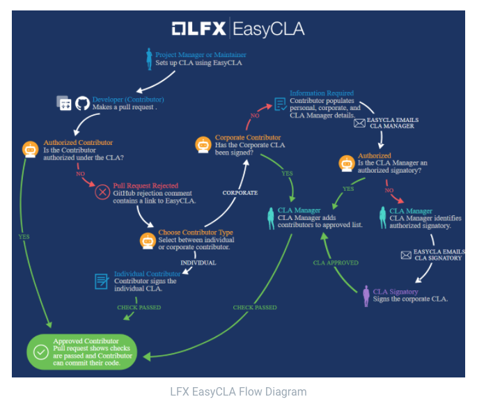

# Test_EasyCLA
Repository dedicated to test EasyCLA.

CLA stands for Contributor License Agreement.

Some groups use a CLA to define the terms under which contributions are licensed to the project.

If your project uses CLA, typically the project needs to ensure that a CLA is signed before a new contribution can be accepted by the project.

## Type of Contributions
### On Behalf of an Individual (ICLA)
For someone that contributes to the project on their own behalf, they need to sign the Individual Contributor License Agreement (ICLA).
### On Behalf of a Corporate (CCLA)
For those that contribute to the project on behalf of their own companies, they need to sign the Corporate Contributor License Agreement (CCLA).

It is expected than in this case the contributor might not be authorized to sign legal agreements like a CLA on behalf of their company. The CCLA workflow has in consideration these restrictions.

### CLA Workflow
The Linux Foundation built EasyCLA to help projects to automate the process by which corporates and individuals contribute to a project.

## Create a Pull Request

## Sign an Individual CLA (ICLA)
[How to Sign an Individual CLA (video)](https://lfx.linuxfoundation.org/wp-content/uploads/2021/03/EasyCLA_ICLA-Workflow_v2.mp4)

## Sign a Corporate CLA (CCLA)
[How to Sign & Approve a Corporate CLA](https://lfx.linuxfoundation.org/wp-content/uploads/2021/03/LFX-EasyCLA-_Corporate-Contrutor-Workflow_v2-2.mp4)

Test Jubac
